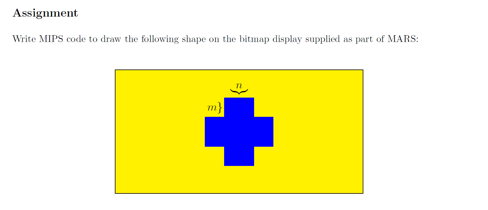
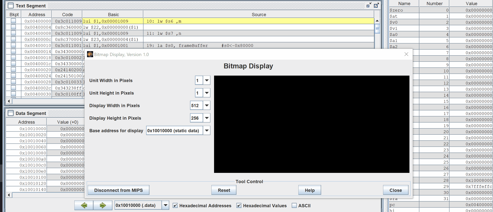

# MIPS-Project
Write MIPS code to draw a yellow background with a blue cross on the bitmap display using MARS. 

This code runs on the MARS program. The following is the output of my project with an m of 100 and an n of 50. 

